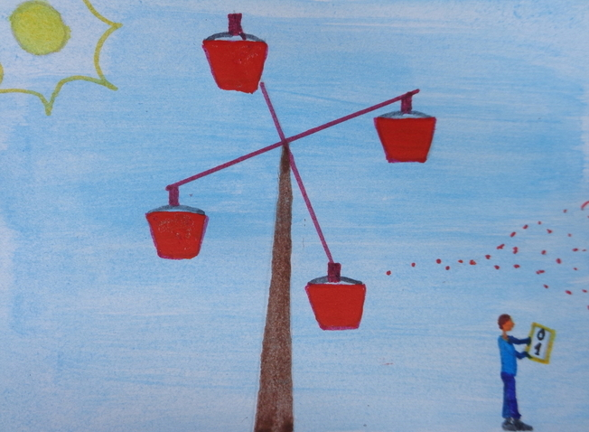

# Pragmatrix: The unambiguous worth of ambiguity

I might be wrong, because I have just recently started dabbling in Data Science, as the code to be found above might have already given away, but I have this very annoying and probably unfair impression that there are many experts who firmly believe that there will come a day when a few genii come together and in their garage-like lair give birth to a very convoluted brain-like machine that, after landing in Google’s mighty hands, will on its own be capable of, for all intents and purposes, making sense of the world, deciphering what people mean with what they put in words and, perhaps, even get at that slippery bastard known as the truth. I, however, have always been a staunch disbeliever and am perhaps precisely therefore less eager to buy into the claim that our Maker is waiting for us around the corner.

To me, language is meant to meet our need to feel part of a bigger entity than ourselves, while still distinguishable from the rest of our family members, may those be whomever we choose to identify as such. By virtue of our use of language, we aim to be recognised as both cognisant and, to some extent, respectful of the conventions ruling how reality is to be understood so that it proves profitable to us, as well as worthy of the honor that is bestowed upon those who know how to defy them so as to keep refining them, which is what lets us keep pace with the constantly changing reality. Hence, for language to keep being relevant to us, it must allow us to be unpredictable, and it can only do that if it is subject to human interpretation, namely, ambiguous. Not only is it a human prerogative that of resolving what each linguistic instance means, but, specifically, that of the addressees to whom the speakers choose to relay their messages.

By now, you might be wondering what all this pseudo philosophical crap is doing on Github, of all places. Well, while I don’t believe that, say, a neural network can provide us with the answer to what people mean with what they say, I think machine learning can be very useful in helping us determine how aware people are of how their messages might be received given a context that severely constrains what they might want to refer to, for, although what an utterance can mean is always bound by the communicative situation where it takes place, some situations allow for the conveyance of a wider range of possible meanings than others. I also hold that, more often than not, the more aware people seem of how the language they express themselves in portrays them, the more reliable they turn out to be, because, as I see it, reality is none other than what we have, over generations, decided to include in our definition of ‘reality’, which only encompasses those aspects and dimensions of the same that we, with our limited physical and mental resources, can afford to take into consideration, because time has shown us that we, as a species, have a better chance of survival if we do.

In order to make my point that form and content are interdependently linked to one another, I have decided to get ahold of the online reviews customers have written of the businesses that are advertised on Yelp, on the one hand, and of the movies and TV-series Amazon supplies, on the other, and try to establish a correlation between the ratings they received from its readers on what Yelp and Amazon labeled as ‘helpful’, ‘useful’, ‘cool’ and ‘funny’, and their computer-based similarity to the material published on online repositories of literature. I know it sounds bizarre to want to form an association between a text’s ambiguity and its capacity to be perceived as useful, but, before rejecting the notion completely, let me first try and explain the underlying motivation behind it.

In my opinion, literature’s main purpose is that of conveying what cannot be said explicitly, because it is so painful or uncomfortable to hear that it would be dismissed right away, and we need time to come to grips with the fact that there are tenable points of view we cannot adopt—for nobody has, on their own, a three-sixty-degree view of their surroundings. However, not only does time play a crucial role in allowing us to find a way to come around and make ours what initially wasn’t, but so does the hope of being understood a bit better, which is also what literature offers, because, in spurring us to relate with a fictional character, it provides our own story with a storyline, a coherence, that, in turn, makes us feel chosen, wanted, and hence, indispensable. At the end of the day, it all depends, of course, on what each of us defines as being useful or helpful given the context at hand, but I believe that, if how a language manifests itself can be regarded as indicative of how its speakers have chosen to understand the world around them, than it might not seem too far fetched to think that helpful is what provides us with help, when we need it, that is, which is probably not when all we seek is to have our own belief system confirmed.

One might want to argue, though, that business or movie and TV reviews are not meant to encourage us into shifting our perspectives on reality, but to allow us to make up our minds on whether we would enjoy the experiences other users of the site that offer them have had previously. Nevertheless, we will only be able to trust online review writers’ judgements if we deem them sound, because of how those displaying them express themselves, which is our only way of assessing the extent to which we find them deserving of our trust. And I reckon that, to sound trust-worthy, people need to write in a way that shows that they have contemplated the implications of choosing a different way to approach reality when deciding on the slant they deliberately select to put on their objects of observation.

Given that, of all forms of expression, literature is the one that doesn’t anticipate its target audience to start but form very general assumptions about what the message being delivered is going to look like, it requires of its authors to know how to meticulously shape their readers’ expectations, because they will have to, at some point, betray those expectations in order to articulate something meaningful, and if they haven’t been able to prove to their audience that they have an inkling of how other people see the world, they won’t be able to achieve their goal, which, ultimately, is that of challenging people’s preconceived notions so as to broaden their understanding of reality’s behavior. Hence, the language intended for writing literature must be wielded like a scalpel and those who employ language the way literature authors do have, in my opinion, a better chance at shaking people’s convictions and leading them to open their eyes to the advantages of assuming their own limitations and adopting a different standpoint.

Having said all this, what works in theory doesn’t always work in practice, for reality, the one  stretching beyond language’s boundaries, refuses to be tamed right away—which is like stating that the world is noisy—and I believe it is very difficult to indisputably prove the validity of a postulate that rings ‘revolutionary’, in that it bucks the current trend in NLP of only focusing on the semantic aspect of language.

I won’t disclose my findings just yet, because I want to have a chance to do so for the first time on the 3rd of July, at 17:45, at Warschauer Str. 70A, in Berlin. Attendance at [the event](https://www.meetup.com/es/Data-Science-Community-Day/events/251477730/) is open to everyone and free of cost, so you are all most welcome to come and share your views on the topic with me right afterwards over a round of free pizzas and drinks. In the meantime, I leave you with the code, for those impatient souls among you who might want to run it and get the results in advance—it takes approximately three days to execute the whole code completely—, the guide to the code, which is located in the Documentation folder, and the Prezi slides with further details on what I have analysed to come to my final conclusions.
