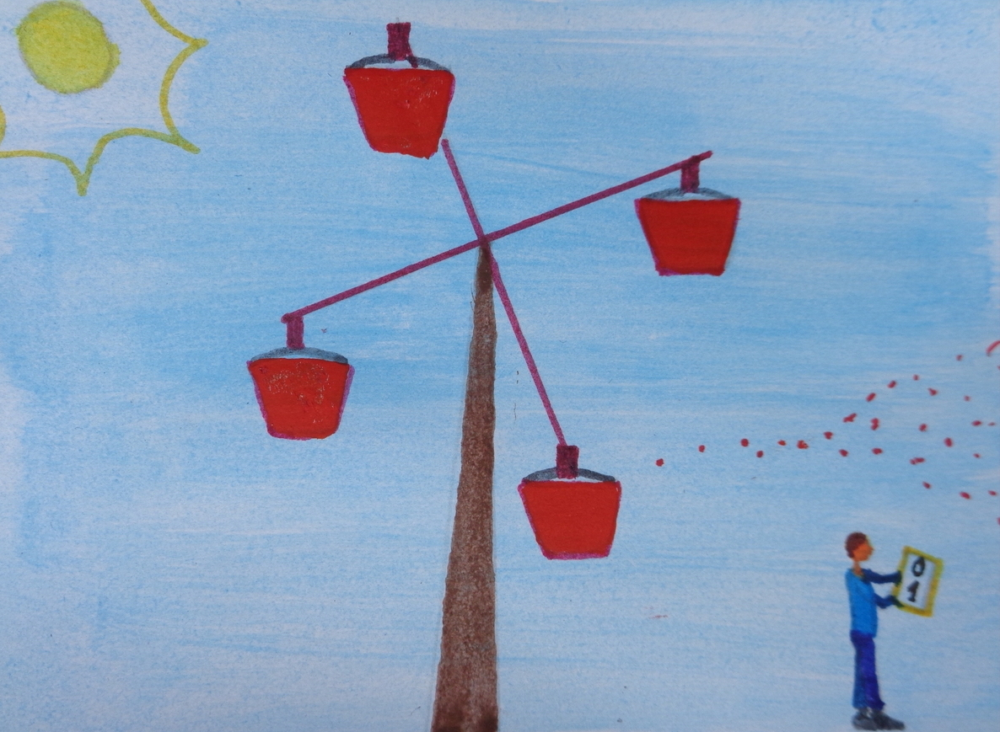

# Pragmatrix

I might be wrong, because I have just recently started dabbling in Data Science, as the code to be found above might have already given away, but I have this very annoying and probably unfair impression that there are many experts who firmly believe that there will come a day when a few genii come together and in their garage-like lair give birth to a very convoluted brain-like machine that, after landing in Google’s mighty hands, will on its own be capable of, for all intents and purposes, making sense of the world, deciphering what people mean with what they put in words and, perhaps, even get at that slippery bastard known as the truth. I, however, have always been a staunch disbeliever and am perhaps precisely therefore less eager to buy into the claim that our Maker is waiting for us around the corner. 

To me, language is meant to meet our need to feel part of a bigger entity than ourselves, while still distinguishable from the rest of our family members, may those be whomever we choose to identify as such. By virtue of our use of language, we aim to be recognised as both cognisant and, to some extent, respectful of the conventions ruling how reality is to be understood so that it proves profitable to us, and, simultaneously, worthy of the honor that is bestowed upon those who know how to defy them so as to keep refining them, which is what lets us keep pace with the constantly changing reality. Hence, for language to keep being relevant to us, it must allow us to be unpredictable, and it can only do that if it is subject to human interpretation, namely, ambiguous. Not only is it a human prerogative that of determining what each linguistic instance means, but, specifically, that of the addressee to whom the speaker chose to relay his message. 

By now, you might be wondering what all this pseudo philosophical crap is doing on Github, of all places. Well, while I don’t believe that, say, a neural network can provide us with the answer to what people mean with what they say, I think machine learning can be very useful in helping us predict how aware people are of how their message might be received given a context that severely constrains what they might want to refer to, for, although what an utterance can mean is always bound by the communicative situation where it takes place, some situations allow for the conveyance of a wider range of possible meanings than others. I also hold that, more often than not, the more aware people seem of how the language they express themselves in portrays them, the more reliable they turn out to be. Reliable in the sense that they have a better understanding of how systems work, systems such as language or reality. 

This brings me to the project I am hereby introducing to you. 

Meet Pragmatrix: an attempt at showing which of its features make a given text more or less recognisable as an example of the type of texts the site it was extracted from hosts.
